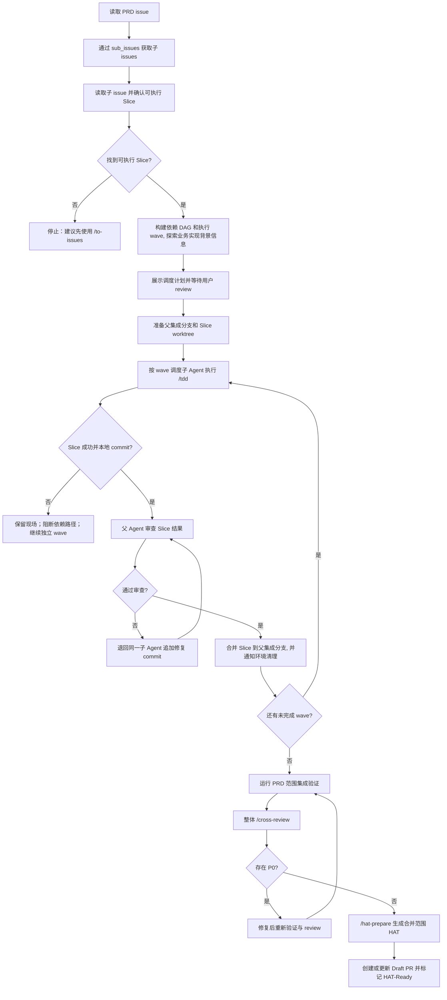

# Deliver PRD

Deliver PRD 是父 Agent 编排型交付流程。它从一个 GitHub PRD issue 出发，发现实现 Slice，按依赖关系调度子 Agent，在独立 worktree 中完成 Slice，再由父 Agent 集成所有 Slice，并对整个 PRD 范围执行最终交付门禁。

它位于 `/deliver-issue` 之上，但不负责把 PRD 拆成 Slice。若 Slice issue 尚不存在，应先使用 `/to-issues`。

## 边界

- v1 支持 GitHub PRD issue。
- 当前 checkout 是父 Agent 的编排工作区：发现、计划、调度控制、集成、cross-review、HAT 准备、提交、推送和 PR 创建。
- 每个 Slice 必须在独立 git worktree 中执行。
- 若项目已有 Agent Runtime，则父 Agent 和 Slice 都需要在 Agent Runtime 中运行；若没有，则子 Agent 继续使用 worktree 隔离。
- 子 Agent 每次只实现一个 Slice，并使用 `/tdd` 或等价红绿重构实践。
- 子 Agent 在自己的 Slice 分支本地 commit，但不 push
- 父 Agent 为整个 PRD 交付创建或更新一个 Draft PR，并标记 `HAT-Ready`。
- 不运行 `/hat-run`。

## 发现

改代码前先收集事实：

- 检查 GitHub、分支、worktree、dirty state、既有 PR 等交付前置状态。
- 读取 PRD issue 正文和评论，包括 Source Manifest。通过 GitHub sub-issues 获取父 PRD 的子 issue。
- 优先使用 `<current_skill_dir>/scripts/list_sub_issues.sh <prd-number>` 获取指定 prd 的子 issue，或跨仓库时传 `--repo <owner/repo>`。
- 逐个读取 sub-issue 的正文、评论和标签，确认哪些是可执行 Slice；不明确的 sub-issue 归为 ambiguous，放进计划中，没有用户确认前不执行。
- 如果找不到 Slice issue，停止并建议先使用 `/to-issues`。
- 从 Slice issue 的 `Blocked by`、`Depends on`、`依赖` 等区块读取依赖并构建 DAG。外部 blocker、循环依赖或无法解析的依赖会阻塞受影响的 Slice，直到用户解决。
- 探索需要完成 PRD、slice 任务的相关背景信息.

## 计划门禁

创建分支、创建 worktree、启动子 Agent 或开始实现前，必须先展示调度计划并等待用户 review。

计划必须包含：

- 父 PRD issue 和来源证据。
- confirmed、skipped、ambiguous 的 sub-issues。
- Slice 依赖 DAG 和执行 wave。
- 父集成分支，默认 `prd/<prd-number>-<slug>`。
- Slice 分支，默认 `slice/<prd-number>-<slice-number>-<slug>`。
- Worktree 路径，以及是否可用 Agent Runtime（如果可用， 必须强制 Sub Agent 使用）。
- 子 Agent 职责边界。
- Merge、父 Agent review、cross-review、HAT 准备、commit、push、PR、`HAT-Ready` 门禁。
- dirty worktree、缺失测试计划、外部 blocker、运行态状态或来源不明确带来的风险。

## 调度

按依赖 DAG 为每个可执行 Slice 启动一个子 Agent(不能继承上下文)。无依赖 Slice 可以并发；有依赖 Slice 只能在 blocker 已合并进父集成分支后启动。

给子 Agent 的 brief 必须表达这些约束，但应根据 Slice 和项目上下文自然组织，不要机械套模板：

- 明确父 PRD、目标 Slice、分支和 worktree, Agent Runtime 运行模式。传递 slice 相关的 Source Manifest
- 使用 `/tdd` skill 执行；若当前环境不支持 slash command，则遵守等价的红绿重构实践。
- 只实现该 Slice，在本地 commit；不要 push
- 返回父 Agent 合并和审查所需的信息：commit、测试证据、变更文件、风险和 Source Manifest 证据。

若某个 Slice 失败，保留它的 worktree、分支、日志和 summary。不要启动依赖它的 Slice，但可以继续无依赖的执行 wave。在所有 confirmed Slice 成功前，不进入最终 cross-review、HAT 准备或 PR。

## 子 Agent 生命周期

- 子 Agent 只在调度计划通过 review 后创建；有依赖的 Slice 只能在 blocker 已合入父集成分支后创建。
- 一个子 Agent 对应一个 Slice、一个 Slice 分支、一个独立 worktree，以及可选(支持时必须强制)的 Agent Runtime sandbox。父 Agent 需要记录它的身份、worktree、分支、运行态和当前状态。
- 子 Agent 完成首次实现后不要自行结束交接；它应保持可召回，直到父 Agent 完成结果审查并决定通过、返工或阻塞。
- 如果父 Agent 审查发现 P0、未满足验收标准或明确属于该 Slice 的缺陷，优先让同一个子 Agent 在同一 worktree/分支追加修复 commit。
- Slice 通过审查、合入父分支并完成必要的集成验证后，父 Agent 才能结束该子 Agent。若使用 Agent Runtime，结束前通知子 Agent 在其 worktree 中停止并清理运行态。
- 失败或阻塞的 Slice 保留 worktree、分支、日志和 summary 作为证据；可以停止运行态以释放资源，但不要清理可复盘的交付现场。

## 父级审查与集成

合并 Slice 前，父 Agent 必须审查子 Agent 结果：

- 检查 diff、commit、测试证据、验收标准和已报告风险。
- 参考 `/cross-review` 的严重度语义作为轻量门禁：P0 或未满足验收标准，必须退回同一个子 Agent，在同一分支继续追加 commit。
- 判断 P1/P2 是否阻塞合并；不阻塞的发现记录到最终 PR notes。

通过审查的 Slice 默认使用 `git merge --no-ff` 合并进父分支，以保留子 Agent 交付边界。父 Agent 负责 merge conflict 和 integration failure。若失败明显属于单个 Slice，将证据退回该子 Agent；若多个 Slice 暴露设计冲突，停止并等待用户 review。

风险较高时，在每个依赖 wave 或每次合并后运行合适的集成测试。

## 最终门禁

所有 confirmed Slice 合并后：

- 运行适合整个 PRD 范围的集成验证，例如测试、typecheck、lint、build、E2E 或 service smoke。
- 运行 `/cross-review`；P0 回到实现修复循环，P1/P2 保留到 reviewer notes。
- 运行 `/hat-prepare`，为完整 PRD 交付生成一个合并范围的 HAT。
- 用户确认后，从父分支提交实现、测试、集成修复和 HAT 产物。
- 用户确认后，创建或更新一个 Draft PR 并添加 `HAT-Ready`。不要静默创建 label。

PR 正文必须包含：

- Parent PRD 引用，默认不关闭父 PRD。
- 每个已交付 Slice issue 的 `Closes #<slice>`。
- TDD/测试摘要、父级审查摘要、cross-review 摘要和日志路径、HAT guide 和 prepare script 路径、未解决 P1/P2 notes，以及 HAT 尚未执行的明确说明。
- Source Manifest，记录原始 PRD、Slice issues、产物、关键决策、验证证据和未决风险。

## 完成

最终回复应包含 PR URL 或阻塞原因、父分支、已交付 Slice、跳过/模糊 issue、子 worktree/分支、测试摘要、cross-review 状态、HAT 路径、Draft/`HAT-Ready` 状态和剩余风险。
